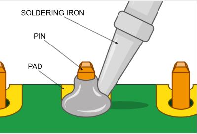
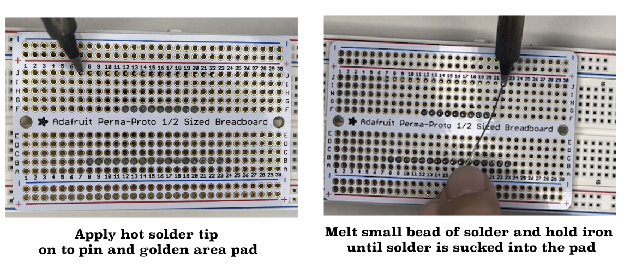
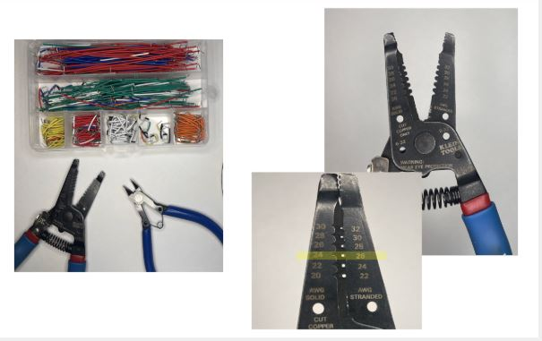
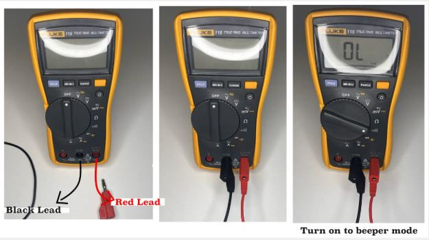
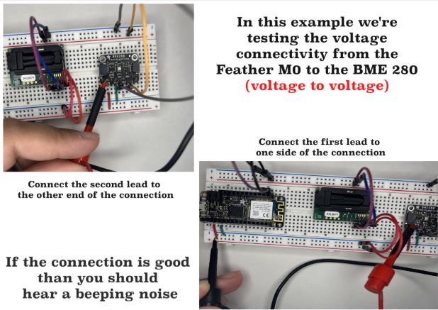

# Electronics Skills Guide

## Soldering Safety

**Always follow these safety guidelines before beginning any soldering work:**

* Wear eye protection (goggles or safety glasses)
* Never touch a hot soldering iron to yourself or anyone else
* When not using the soldering iron, place it in a soldering iron holder to avoid fires and burn accidents
* Lower the power or turn off the soldering iron when it is not in use
* Do not directly expose yourself or others to solder fumes. Ensure proper ventilation with an air current (fan, etc.) or fume extractor for the solder smoke

## Soldering Practice

### Materials Needed
* Solder training boards
* Solder training pins
* Breadboard

### Tools Required
* Soldering iron
* Soldering wire
* Wet sponge
* Brass wire wool
* Soldering iron holder
* Fans/exhaust for ventilation
* Magnifiers
* Light source
* Tip tinner/cleaner

### Basic Soldering Procedure (For Beginners)

1. **Setup**: Put two rows of male header pins into the breadboard with the long pins down and place the training board on top with the text facing up so that the short pins poke out of the training board where you want them.

   

2. **Prepare the iron**: Turn on the soldering iron and set the temperature to the suggested value (written on the control box). Wait until it reaches the set temperature.

3. **Begin soldering**: Starting on one end of the row of pins, place the flat end of the tip of the soldering iron on the pin and pad so that it touches them both simultaneously, then bring the solder wire to the junction.

   

4. **Apply solder**: Melt a small bead of solder and hold the hot iron until the solder is 'sucked' into the pad.

   

5. **Remove iron**: Quickly remove the iron (be aware of time, since the board can get overheated).

6. **Continue pattern**: Repeat with the pin on the opposite end and continue going back and forth until you finish the last pin somewhere in the middle. This allows the area around the soldered pins to cool off a little.

7. **Practice**: Practice this technique for several rows of pins.

### Advanced Soldering: Without Breadboard Support

**When you're ready to solder directly to PCB boards:**

1. **Position components**: As best you can, place the pins or header into the PCB board and place the board on the table with the longer end of the pins/header sitting at an angle to the table.

2. **First solder joint**: Apply the soldering iron to an end pad and pin, allowing the iron to heat the pad/pin.

3. **Add solder**: Place the soldering wire into the iron/pad/pin junction.

4. **Create joint**: Melt a small bead of solder into the pad and hold until the melted solder is 'sucked' into the pad/pin.

5. **Remove iron**: Quickly remove the iron. At this point the pins will probably be crooked with respect to the PCB board.

6. **Align header**: With one hand, hold the PCB board and place a finger on the header on the opposite side and end of the newly soldered pin.

7. **Re-melt and align**: Apply the iron onto the soldered pin to re-melt the solder. This will allow you to align the header with your finger to make a 90-degree angle with the test board.

8. **Continue soldering**: This single soldered pin will hold the entire row of pins or header in position, allowing you to proceed as above with the rest of the pins! 

   **Note**: Make sure to apply enough pressure so the header makes full contact with the PCB board.

**Video demonstration**: [Edited Video of Advanced Soldering.mp4](https://drive.google.com/file/d/1IDuTgYlEillcRoKbDvMZIReiyKo5U2Oj/view?usp=sharing)

### Additional Soldering Resources
* [How to Solder Pin Headers](https://www.youtube.com/watch?reload=9&app=desktop&v=TFfMYYBRu30)
* [Collin's Lab: Soldering](https://www.youtube.com/watch?v=QKbJxytERvg)
* [From Solderless Breadboard to Soldered Circuit - Electronics with Becky Stern | Digi-Key Electronics](https://www.youtube.com/watch?v=F9Krq7seV1g)
* [Let's Play - Toobers!](https://web.mit.edu/2.00b/www/toobers/pcbassembly1.html)

## Wire Preparation: Stripping Solid Jumper Wires

### Materials and Tools
* Solid jumper wires
* Wire snips
* Wire stripper

### Procedure
1. **Measure length**: First, estimate how long you will need the cable to be by laying it down to the points you are trying to connect and leaving room for the insertion part.

2. **Cut to length**: Next, grab the snips and cut the desired length.

3. **Strip ends**: Once you have the length you want, grab the wire stripper and strip off the ends that will be inserted into the breadboard.

### Video Tutorial
* [Cutting Perfect Jumper Wires](https://www.youtube.com/watch?v=ver-Av8vr1Q)

## Testing Connections: Using the Multimeter

### Tools Required
* Multimeter
* Testing leads (banana plugs/alligator clips/test hooks)
* Assembled and wired board (i.e., any connection you'd like to test)

### Testing Procedure

1. **Setup multimeter**: Grab a multimeter and connect leads to respective inputs.

2. **Select function**: Turn on the multimeter to the desired test function. For this procedure we will be using the continuity function (wave of curved lines).

   

3. **Test multimeter**: Once the multimeter is set to the continuity function, touch the two leads together. If you hear a beeping noise, the continuity function is working properly.

4. **Test connection**: Touch the probes to each end of the connection you want to test. If you hear a beep, the connection is stable.

   

### Video Tutorial
* [What is Continuity and How to Test](https://www.youtube.com/watch?v=5G622WDZaHg)

## Additional Learning Resources

### Soldering Tutorial Videos
* [How to Solder Pin Headers](https://www.youtube.com/watch?reload=9&app=desktop&v=TFfMYYBRu30)
* [Collin's Lab: Soldering](https://www.youtube.com/watch?v=QKbJxytERvg)
* [From Solderless Breadboard to Soldered Circuit - Electronics with Becky Stern | Digi-Key Electronics](https://www.youtube.com/watch?v=F9Krq7seV1g)
* [Let's Play - Toobers!](https://web.mit.edu/2.00b/www/toobers/pcbassembly1.html)

### Wire Preparation Tutorial
* [Cutting Perfect Jumper Wires](https://www.youtube.com/watch?v=ver-Av8vr1Q)

### Multimeter Tutorial
* [What is Continuity and How to Test](https://www.youtube.com/watch?v=5G622WDZaHg)