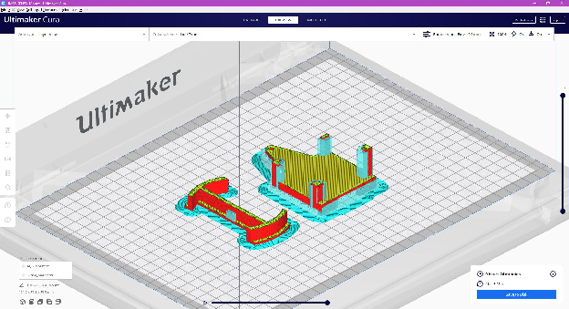
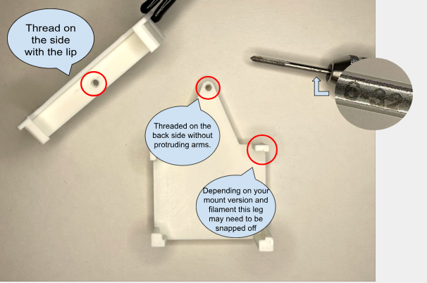
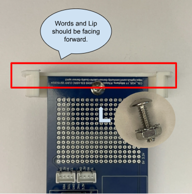
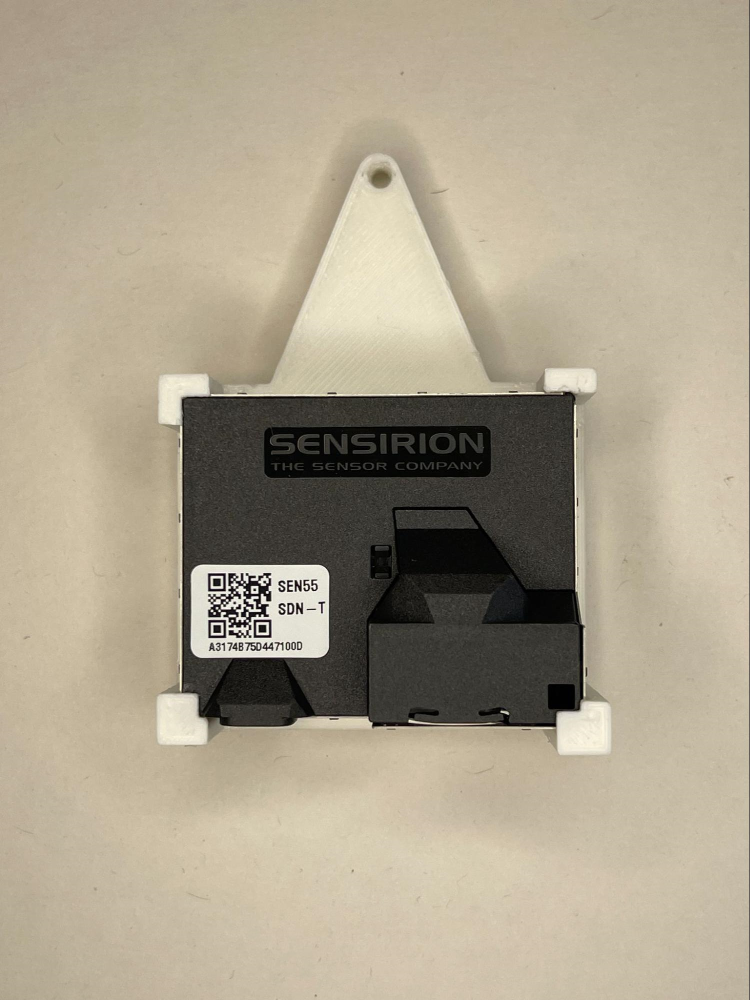
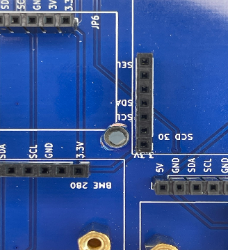
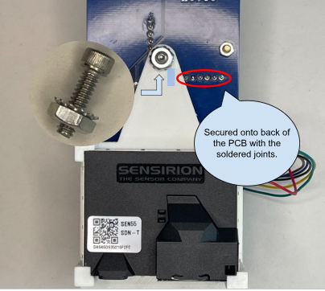
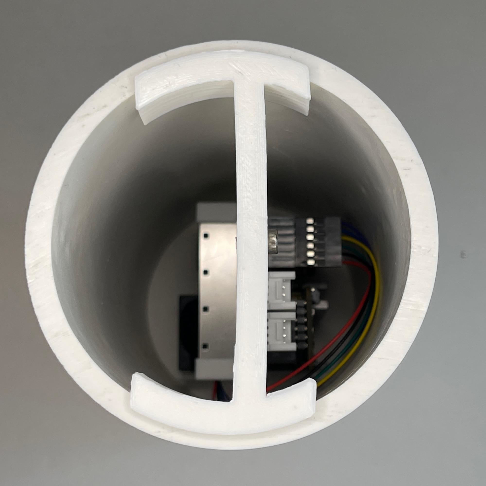

# 3D Printing and Assembly Guide

## Finding Files
Files for both the PCB and Sensirion Mount will be located on the [Community Sensor Github](https://github.com/Community-Sensor-Lab/Air-Quality-Sensor/tree/master)

- Download and import the STL files into your 3D Printing Software
- Add supports wherever required

---

## Assembly Instructions

### Step 1: Thread Preparation
When the two mounts are completed, thread the holes with a 6-32 thread (Not required on newest mount iterations)

### Step 2: PCB Mount Installation
Secure the AQS Mount onto the top hole with a [Grainger #6 Screw](https://www.grainger.com/) (6-32 x 12" Phillips Head Screw) with a 6-32 lock nut and a Phillips Bit or 6-32 x 12" Screw with a 6-32 lock nut and a [H2.5 Bit](https://www.mcmaster.com/). 

**Important:** Make sure that the PCB is screwed into the side with the Lip so that the PCB will be secure in a vertical position.

### Step 3: Sensor Installation
Insert the [SEN5X](https://sensirion.com/products/catalog/SEN54/) into the Mount

### Step 4: Alignment Check
Make sure that the holes line up for the SEN5X Mount and the PCB Board

### Step 5: Sensor Mount Security
Secure the SEN5X Mount using the hole in the middle of the PCB. Use a 6-32 x 12" Screw with a 6-32 lock nut and a H2.5 Bit or 6-32 x 12" Phillips Head Screw. 

**Note:** This mount should be on the back of the PCB with all the soldered joints.

### Step 6: Final Assembly
Insert the AQS into a [3in PVC Pipe](https://www.homedepot.com/). It is a tight fit so try to use moderate pressure while rotating the AQS for it to be fully placed into the PVC Pipe.

---

## Required Materials
- 6-32 x 12" Phillips Head Screws
- 6-32 lock nuts
- Phillips screwdriver or H2.5 Bit
- 3" PVC Pipe
- SEN5X Sensor
- 3D printed PCB and Sensirion mounts