**Installing Arduino**  
To get started, make sure the **Arduino application** is installed on your computer or laptop. If it hasn't been installed yet, visit the [Arduino website](https://www.arduino.cc/en/software/) to download and install it.  
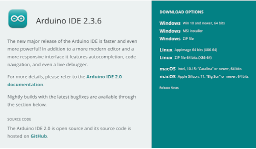

# Arduino Download Instructions

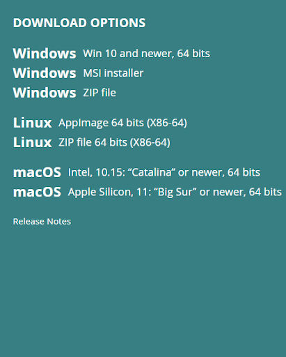

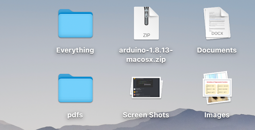

On the Arduino download page, choose the version that matches your computer's operating system.

## For Windows users:

- **Do not** select the **.zip file** option.
- Instead, choose either **"Windows 64-bit App"** or **"Windows Installer"** for proper installation.

## After the download is complete:

- **On a Mac**: The zip file may appear on your **Desktop** or in your **Downloads** folder.
- **On Windows**: The zip file will typically be found in your **Downloads** folder or on your **Desktop**.

  **On a Mac**:

  

* Open the downloaded zip file.  
* The Arduino application will appear—**drag it into your  Applications folder** to install it.

**On Windows**:

* Open the file you downloaded—either the **64-bit App** or the **MSI Installer**.  
* Follow the prompts to complete the installation.

---

**Arduino Environment**

Now that the Arduino application has been installed successfully, open it. The Arduino IDE should look something like this:

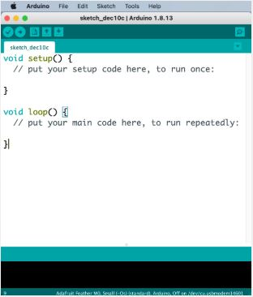

- This is where the code is written to run Arduino programs
- Any error messages will appear **in the margins of the black console window** when you run your code

## Installing Required Packages and Libraries

Before running any programs on your **Arduino**, you must install a few essential packages and libraries. Without these, the Arduino won't be able to execute your code.

### Install Adafruit Board Package

This initial installation is required to give the Arduino application access to specific Adafruit libraries you'll need.

1. **Access Preferences**
   - Click on the Arduino drop-down menu and select Preferences (or Arduino → Settings)
   
   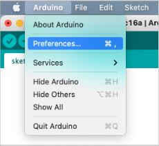
   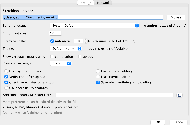

2. **Add Board Manager URL**
   - Copy this link: **https://adafruit.github.io/arduino-board-index/package_adafruit_index.json**
   - Paste the link in "Additional Boards Manager URLs"
   
   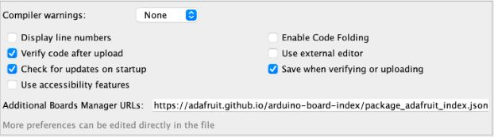

3. **Apply Settings**
   - Click "Ok" and close the Arduino Application

4. **Install Adafruit Boards**
   - Go to Tools → Board → Boards Manager
   
   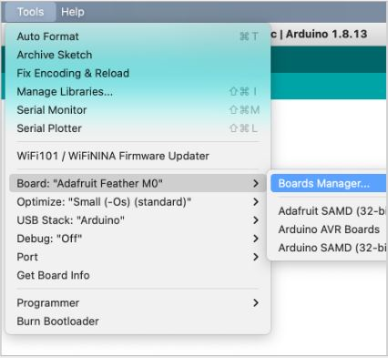
   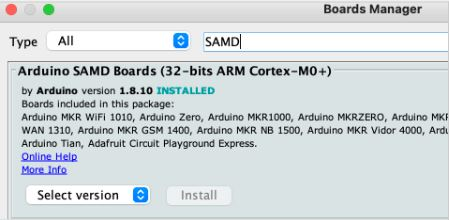

5. **Close Boards Manager**
   - Once you are done downloading the necessary boards, close the Boards Manager window
   
   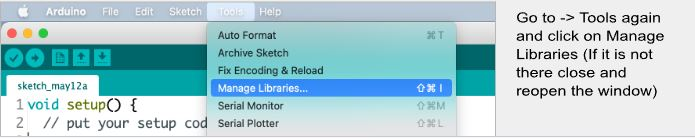

### Install Required Libraries

1. **Access Library Manager**
   - Go to Tools → Manage Libraries

2. **Install WiFi101 Library**
   - In the search bar type "WiFi101" and install the library called "WiFi101"
   
   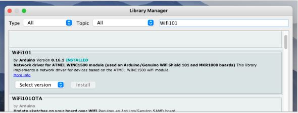

3. **Install Additional Libraries**
   
   Repeat the search and install process for the following libraries (for libraries that require other libraries to be installed, click install all when prompted):

   - Adafruit Sleepy Dog
   - SparkFun SCD4X Arduino Library
   - Adafruit GFX
   - Adafruit SSD1306
   - Adafruit BME280
   - Adafruit SH110X
   - Sensirion I2C SEN5X
   - flashstorage
   - WiFi101
   - Honeywell TruStability SPI

4. **Install RTClib Library**
   - Download RTClib from [Github](https://github.com/adafruit/RTClib)
   - In Arduino IDE: Select Sketch → Include Library → Add .ZIP Library
   - Open the ZIP folder that you have just downloaded

**Installation Complete!** You now have all the necessary components installed.

---

## Connecting and Testing Your Arduino

### Hardware Connection

1. **Connect Arduino to Computer**
   - Plug in your Arduino to your laptop using a Micro-USB Cable
   - If you do not have a USB port on your computer, you will need an adapter
   
   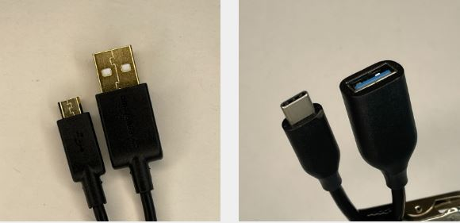

### Software Configuration

2. **Select the Correct Port**
   - Launch Arduino IDE and select the correct port with the dropdown menu
   
   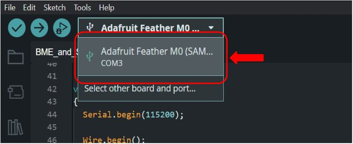

### Code Compilation and Upload

3. **Compile Your Code**
   - When you have the correct port selected and you are ready to compile code to your Arduino, first compile the code to check for any errors beforehand
   
   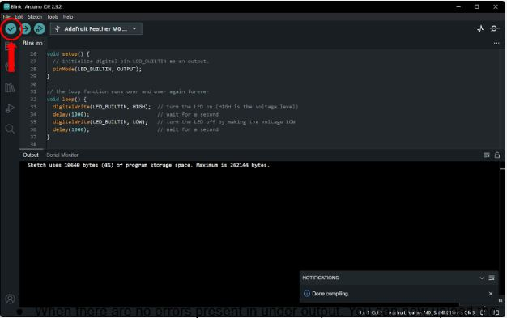

4. **Upload to Arduino**
   - When there are no errors present in the output, you can now upload the code to your Arduino
   
   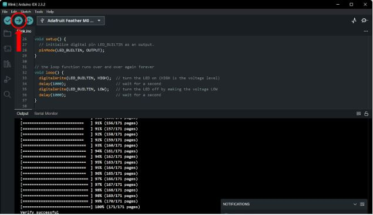

## Testing Your Setup

### Running the Blink Example

Now that you have all the libraries downloaded, you can test the connection between the sensor and your computer.

1. **Load Blink Example**
   - Go to File → Examples → Basics → Blink to pull up the blink code
   - This code can be used to test if the sensor is connected to your computer and can have code uploaded to it
   
   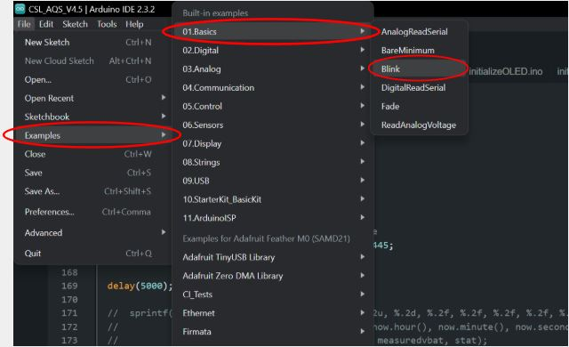

2. **Test the Connection**
   - Upload the code and look at the sensor when the code finishes uploading
   - Check if the light is blinking to confirm successful connection

---

## Troubleshooting

If you encounter issues:
- Ensure the correct port is selected
- Check that all required libraries are properly installed
- Verify your Arduino is properly connected via USB
- Review any error messages in the console window for specific guidance

Your Arduino setup is now complete and ready for sensor projects!