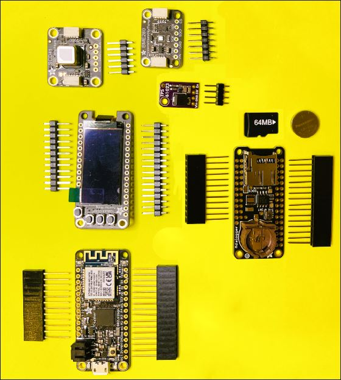
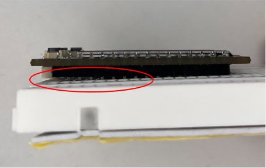
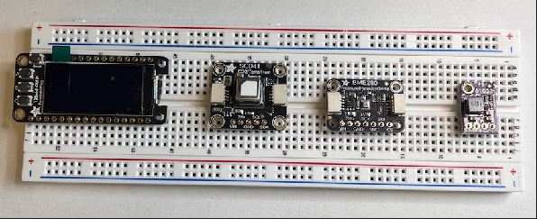
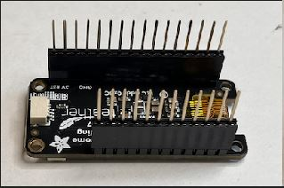
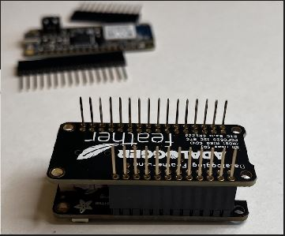
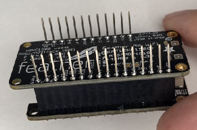
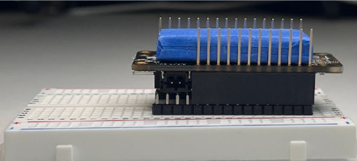
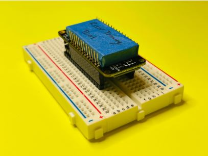

# Component Soldering

## Materials

* Breadboard  
* [BME 280](https://www.adafruit.com/product/2652) - Temperature, humidity & pressure sensor with high accuracy
* [SCD 41](https://learn.adafruit.com/adafruit-scd-40-and-scd-41) - Photoacoustic 'true' CO2 sensor that measures CO2 PPM composition
* 5V Booster  
* SEN55  
* JST Cables  
* Featherwing OLED  
* Featherboard M0 WIFI  
* Adalogger Featherwing  
* Two Feather Stacking Headers Set  
* Micro SD  
* Coin Battery (cr1220)

*All components laid out for inventory check*

## Tools

* [Soldering Iron](https://www.adafruit.com/category/84) - Temperature-controlled recommended for precision work
* Soldering Wire  
* Wet Sponge  
* [Brass Wire Wool](https://www.adafruit.com/product/1172) - For cleaning soldering iron tip
* Fan/Exhaust  
* [Magnifier](https://www.adafruit.com/product/291) - Helps with precision component placement
* Riser Trimming Tool  
* Clipping Tool

## Step 1: Soldering SCD 41, BME 280, 5V Booster, and Featherwing OLED

* Place pin headers evenly spaced out onto the breadboard.  
* Place each sensor board onto the respective pins:  
  * **OLED**: When connecting the OLED to the breadboard, it can't be pushed all the way because pin headers stick out. This allows the OLED to lay perfectly on the black part of the pinheads.

   

* Make sure the [SCD41](https://www.bosch-sensortec.com/products/environmental-sensors/humidity-sensors-bme280/), [BME280](https://learn.adafruit.com/adafruit-scd-40-and-scd-41), and 5V Booster are connected straight on the breadboard.   
  * This can be accomplished by soldering one pin at one end and then applying the heat to move it in place with your other hand.  
  * You can also balance it before soldering by pushing it down with one finger on the pin side to keep it straight.  
* Once you have it straightened properly, complete the soldering for each pin.

## Step 2: Soldering Feather M0 Stacking Header and Logger Stacking Header

* For this part, have your OLED in hand, for it will make it easier to solder.  
* Attach a set of stacking headers to the OLED, then place the Adalogger Featherwing on top faced down.

* Now start by soldering one end at a time.

* Repeat the same steps for the Featherboard M0 WiFi.

## Step 3: Trimming the Stacking Headers

* Place the Riser Trimming tool in between the stacking headers.

