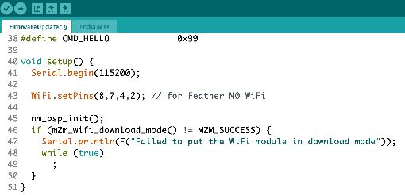
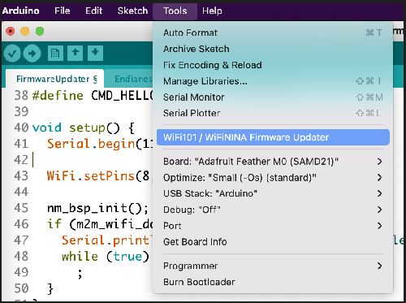
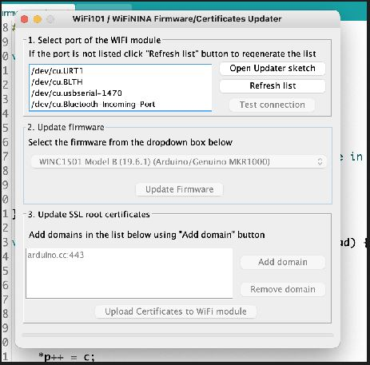

# Setup for a New Adafruit Feather M0 with WiFi (WINC1500)

This step is a one-time procedure for new, out of bag, [FeatherM0 WiFi boards](https://www.adafruit.com/product/3010) (Adafruit).

## ⚠️ Important Requirements

**NOTE: This procedure only works with the old Arduino IDE that has the round icon  **(V1.x)**

**It does not work on the new IDE with the square icon  **(V2.x)**

---

## Step-by-Step Setup Process

### 1. Prepare Your Development Environment

Open the old [Arduino IDE (V1.x)](https://www.arduino.cc/en/software/OldSoftwareReleases). If you don't have it installed, download and set it up. You can have both versions on your computer.

### 2. Install Required Libraries

Check that the latest [WiFi101 library](https://github.com/arduino-libraries/WiFi101) is installed. If not, install or update it through the Library Manager.

### 3. Load the Firmware Updater Sketch

Open the following arduino sketch: **Examples > WiFi101 > FirmwareUpdater**

### 4. Configure for Feather M0 WiFi

In the example, add the line of code shown below at line 43:

*This instruction sets the control pins in the program to work with the Feather M0 Wifi board*

### 5. Upload the Firmware Updater

Upload the code to your board. **Do not open the Serial Monitor.**

---

## Firmware Update Process

### 6. Open the Firmware Updater Tool

At the top of the Arduino IDE window, go to **Tools > WiFi101 / WiFiNINA Firmware Updater** as shown here:

You will get the following window:

### 7. Test Connection

Test the connection between your computer and the FeatherM0WiFi with **1. Select port of the WiFi module.**

### 8. Update Firmware

**2. Update Firmware.** Select the latest version of the [WINC1501 Model B](https://www.microchip.com/en-us/product/ATWINC1500) (19.6.1 in the picture above).

### 9. Configure SSL Certificates

**3. Update SSL root certificates.** 

- Select **Add domain**
- Enter [**www.google.com**](http://www.google.com)
- Repeat and enter **script.google.com** 

Your window should look like this:

### 10. Complete the Setup

Select **Upload Certificates to WiFi module** and the Feather M0 WiFi board is ready for use with Google.

---

## Additional Resources

**More info at:** [Updating Firmware](https://learn.adafruit.com/adafruit-feather-m0-wifi-atwinc1500/updating-firmware)

## Troubleshooting

If you encounter issues during this process:
- Ensure you're using Arduino IDE V1.x (not V2.x)
- Verify the WiFi101 library is properly installed
- Check that your board is properly connected and recognized by your computer
- Make sure you don't have the Serial Monitor open during firmware upload