# How to Assemble Air Quality Sensor Boards

This guide walks you through assembling your air quality sensor, focusing on attaching the boards onto the breadboard and testing each component systematically. Make sure that sensors and boards (with the exception of the SPS30 PM 2.5 Sensor) are soldered to the appropriate headers.

## 📋 Materials Required

**Note:** Refer to the complete [Parts List](https://github.com/Community-Sensor-Lab/Air-Quality-Sensor/blob/master/README.md#Parts-List-) on GitHub for detailed specifications.

### Essential Components:
- [Breadboard](https://www.adafruit.com/product/239) 
- Soldered CPU & WiFi Board ([Adafruit Feather M0](https://www.adafruit.com/product/3010))
- Soldered OLED Display Board
- Soldered Logger & Clock Board ([Adalogger FeatherWing](https://www.adafruit.com/product/2922))
- [Coin Battery CR1220](https://www.adafruit.com/product/380)
- [SD card](https://www.adafruit.com/product/1294) (formatted)
- [Micro-USB to USB cable](https://www.adafruit.com/product/592) (or alternatively, a battery pack)
- Jumper Wires ([Premium Male/Male](https://www.adafruit.com/product/758))

### Sensors:
- Soldered [BME 280](https://www.adafruit.com/product/2652) (Temperature, Humidity, Pressure)
- Soldered [SCD41](https://www.adafruit.com/product/5190) (CO2)
- [SEN55](https://www.sensirion.com/products/catalog/SEN55/) (All-in-one environmental sensor)

### Tools Needed:
- Computer with Arduino IDE installed
- [SD Card Reader](https://www.adafruit.com/product/939) (if not built into computer)
- [SD Card Formatter](https://www.sdcard.org/downloads/formatter/) software

---

## 🚀 Getting Started

### Initial Setup

1. **Prepare your workspace:** Have a clear breadboard in front of you. This will be your main assembly platform.

2. **Organize components:** Keep your FeatherM0 CPU & WiFi board nearby - this is the central hub that all sensors will connect to.

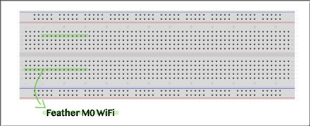

---

## ⚙️ Preliminary Configuration

### Setting Time and Date on Arduino Real Time Clock (RTC)

**Important:** Complete this step before assembling sensors to ensure accurate timestamping.

1. **Install Adalogger:** Insert Adalogger on top of the Feather M0
2. **Open RTC example code:** 
   - Navigate to Examples → RTCLib → Open pcf8523
3. **Modify the code:** Comment out lines 21, 22, and 34 (add `//` at the beginning of each line)

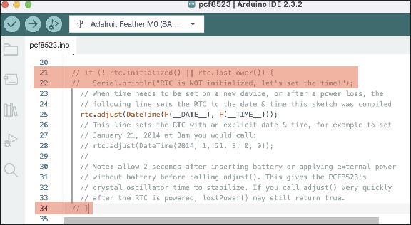

4. **Upload the code:**
   - Select correct board: Tools → Board → Adafruit SAMD boards → Adafruit Feather M0
   - Select correct port: Tools → Port → Select the one with sensor
   - Click Upload

5. **⚠️ Critical:** DO NOT RESET/RESTART THE ARDUINO after uploading as this will reset the clock to compilation time. Instead, proceed directly to upload the main AQI code.

### SD Card Preparation

1. **Download formatter:** Get the official SD card formatter from [https://www.sdcard.org/downloads/formatter/](https://www.sdcard.org/downloads/formatter/)

2. **Format the card:** 
   - Connect SD card to computer (use SD card reader if necessary)
   - Open SD card formatter application
   - Format using recommended settings

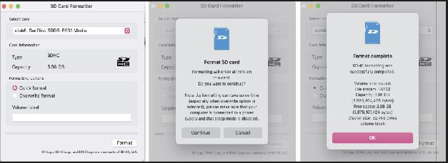

---

## 🔧 Sensor Assembly & Testing

**Assembly Strategy:** We'll add and test each sensor individually to ensure proper functionality before final assembly.

### 1. BME 280 Environmental Sensor

**📖 Reference:** [BME280 Datasheet](https://cdn-learn.adafruit.com/downloads/pdf/adafruit-bme280-humidity-barometric-pressure-temperature-sensor-breakout.pdf)

**Function:** Measures temperature, barometric pressure, and humidity.

#### Placement & Wiring

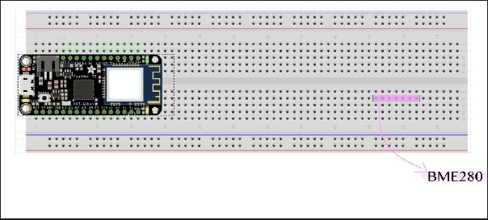

**Wiring Guidelines:**
- **Power:** Voltage connects to red line (+), ground connects to blue line (-)
- Follow the color coding in the image below for accurate connections

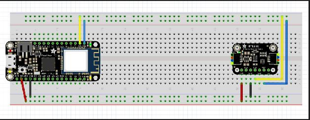

**Connection Map:**
- SCK/SCL → Top row of breadboard
- SDI/SDA → Second row of breadboard  
- VIN/3V → Last row of breadboard
- GND → Second to last row of breadboard

#### Testing BME280

1. **Load test code:** Open Examples → BME280 test

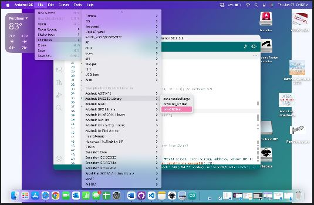

2. **Add debugging code:** After `void setup()` and `Serial.begin();`, add:
   ```arduino
   delay(5000);
   Serial.println(__FILE__);
   ```
   This ensures you can verify successful code execution.

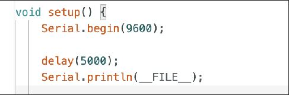

3. **Upload and test:**
   - Connect board with USB data cable
   - Select board and port
   - Verify and upload code
   - Open Serial Monitor to view results
   - **Disconnect USB** before proceeding to next sensor

### 2. SCD41 CO2 Sensor  

**📖 Reference:** [SCD-40 and SCD-41 Datasheet](https://cdn-learn.adafruit.com/downloads/pdf/adafruit-scd-40-and-scd-41.pdf)

**Function:** Photoacoustic CO2 sensor measuring CO2 concentration in PPM (parts per million).

#### Placement & Wiring

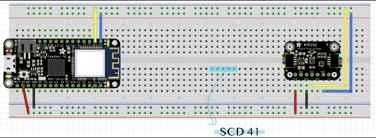

**⚠️ Important:** Keep the BME 280 connected when adding SCD41 - it provides necessary pull-up resistors. Alternatively, you can use the OLED display which also has pull-up resistors.

#### Testing SCD41

1. **Load test code:** Examples → Sparkfun SCD4x Arduino Library → Example8_SCD41SingleShot

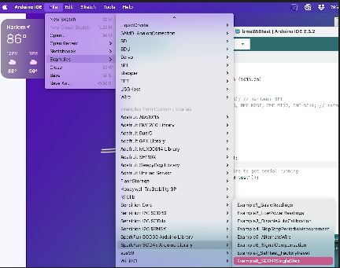

2. **Modify settings:** 
   - Change line 35 to `false false false`


   - Comment out lines 76-92

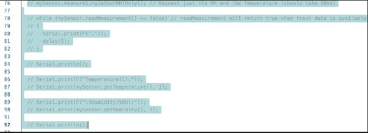

3. **Test:** Follow the same upload and testing procedure as BME 280
4. **Disconnect USB** before proceeding

### 3. SEN55 All-in-One Environmental Sensor

**📖 Reference:** [SEN5x Datasheet](https://sensirion.com/media/documents/6791EFA0/62A1F68F/Sensirion_Datasheet_Environmental_Node_SEN5x.pdf)

**Function:** Comprehensive sensor measuring:
- Particulate matter (PM1.0, PM2.5, PM4.0, PM10)
- Volatile organic compounds (VOCs)
- Humidity and temperature
- Oxidizing gases (NOx)

#### Placement & Wiring

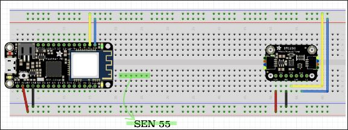

**Note:** Keep BME 280 connected for pull-up resistors (or use OLED display as alternative).

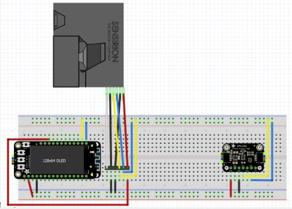

#### Testing SEN55

1. **Load test code:** Examples → Sensirion I2C SEN5x → exampleusage
2. **Test:** Follow the same upload and testing procedure as previous sensors
3. **Disconnect USB** before final assembly

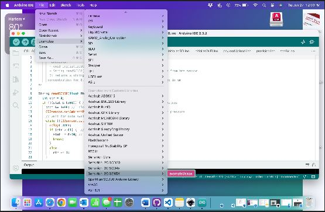

---

## 🎯 Final Assembly

Once all individual sensors have been tested successfully, assemble all components together on the breadboard as shown:

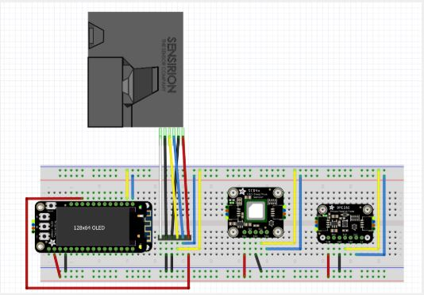

**Final Steps:**
1. Carefully arrange all components according to the layout
2. Double-check all connections match the individual sensor wiring
3. Ensure no loose connections
4. Upload your main AQI monitoring code
5. Test the complete system

---

## 📚 Additional Resources

- [Community Sensor Lab GitHub Repository](https://github.com/Community-Sensor-Lab/Air-Quality-Sensor)
- [Arduino IDE Download](https://www.arduino.cc/en/software)
- [Adafruit Learning System](https://learn.adafruit.com/)

---

## ⚠️ Safety & Best Practices

- Always disconnect USB power before modifying wiring
- Double-check connections before powering on
- Handle sensors gently to avoid damage
- Keep workspace organized and well-lit
- Test each component individually before final assembly