# Code Activity

In this section we're going to get an understanding on where the main code comes from by merging example codes. When merging example codes, we'll be able to test and run two sensors at once. For this exercise we'll be using the [SparkFun single shot code](https://github.com/sparkfun/SparkFun_SCD4x_Arduino_Library/tree/main/examples) and the [BME280 test code](https://github.com/adafruit/Adafruit_BME280_Library/tree/master/examples).

## Prerequisites

If you don't already have the library installed; be sure to install [SparkFun SCD4x Arduino Library](https://github.com/sparkfun/SparkFun_SCD4x_Arduino_Library) through the library manager. This is where you will be able to find the single shot example code.

## Initial Setup

### Opening Up Both Example Codes
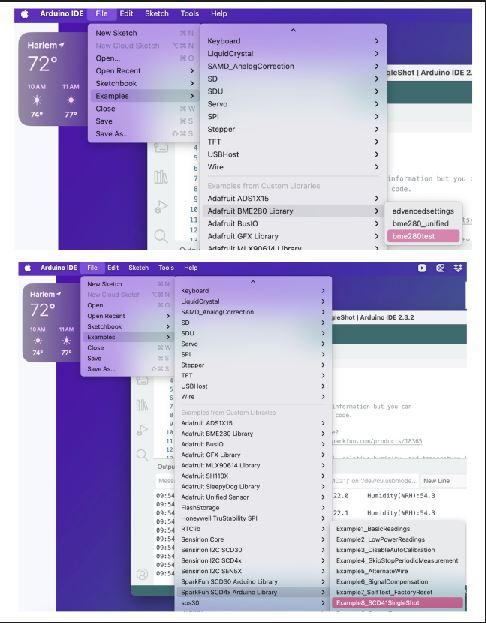

### SCD41SingleShot Edit

Before we continue we will have to make a slight modification to the code. Highlight lines 76 through 92 and click command forward slash (mac) or control forward slash (windows). This will comment out that section of the code, so that the section is disabled when uploading it. **Also change line 35 to false,false,false.**

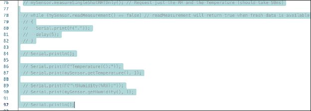

Now we have everything ready to start merging the code.

## Procedure

### Step 1: Create and Set Up New Sketch

Let's start off by creating and setting up our new sketch.

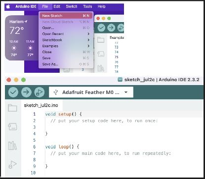

### Step 2: Create Function Tabs

In the sketch we will start off by creating tabs for our functions. We will have four tabs:
1. **SCD41_initial**
2. **BME280_initial** 
3. **SCD41_loop**
4. **BME280_loop**

Creating these functions will help us better manage our code.

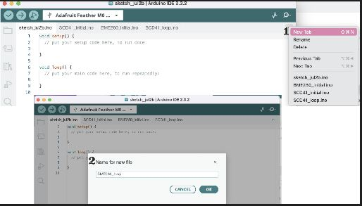

### Step 3: Copy Initial Code Sections

Start by copying over the section before void setup() from both example codes and pasting it on to our new sketch before void setup().

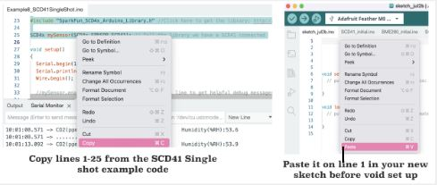

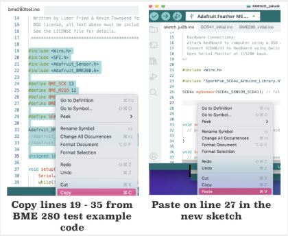

### Step 4: Populate Function Tabs

#### 4a. SCD41_initial Tab

For the SCD41_initial we will copy over the void setup() code:

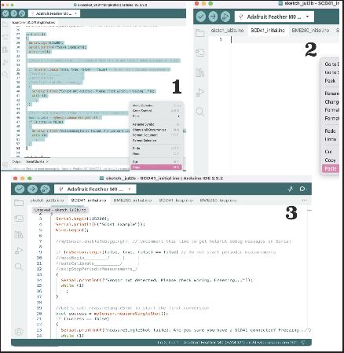

Next we will give the function a new name by replacing setup() with SCD41_initial (recommended) or choose your own name.

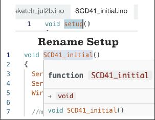

Choose a good name as it will stick and you want to be able to easily identify the function.

#### 4b. BME280_initial Tab

Repeat the same steps for the BME280_initial tab:
1. Copy the void setup code
2. Paste it into the tab

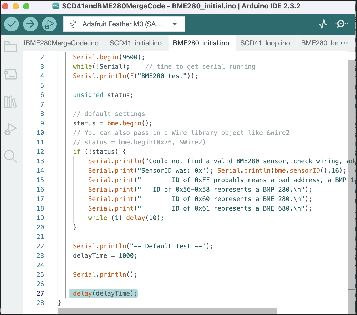

Add `delay(delayTime);` into the end of the function as shown above.

Remove printValues() in line 70 under void loop();

Copy and Paste lines 76 to line 93 into Void loop. This function should be put under the tab BME280_loop.

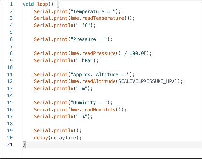

Rename the function appropriately.

#### 4c. SCD41_loop Tab

For the SCD41 loop we will be copying over the void loop code into the tab and renaming the function as well.

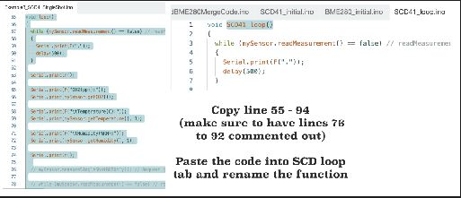

#### 4d. BME280_loop Tab

Repeat the same process for copying over the BME280 loop into the BME280_loop tab:
1. Copy over the void printValues
2. Add `delay(delayTime);` under the Serial.println();

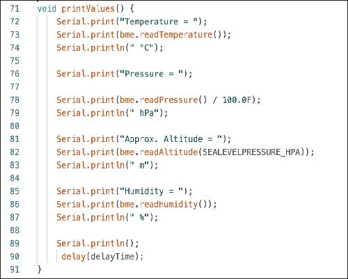

### Step 5: Add Functions to Main Tab

Now we will add the functions we have created to the first tab like so:

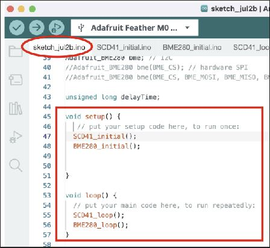

### Step 6: Code Completion

Our code is now complete!

### Step 7: Verify and Upload

Next step is to verify and upload the code to our sensors:

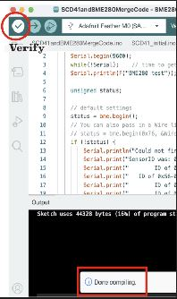

### Step 8: Monitor Results

Once the upload is complete press the serial monitor at the top right corner to see your data results.

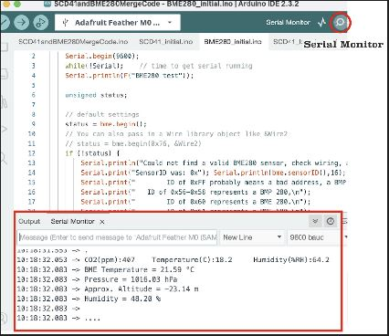

---

## Additional Resources

- [Arduino IDE Documentation](https://docs.arduino.cc/software/ide-v2/)
- [SparkFun SCD4x Library Documentation](https://github.com/sparkfun/SparkFun_SCD4x_Arduino_Library)
- [BME280 Sensor Information](https://www.bosch-sensortec.com/products/environmental-sensors/humidity-sensors-bme280/)
- [Serial Monitor Guide](https://docs.arduino.cc/software/ide-v2/tutorials/ide-v2-serial-monitor/)