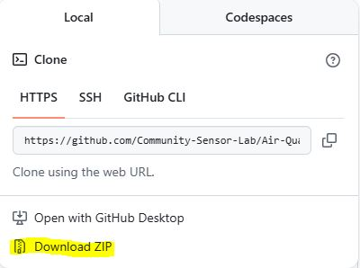
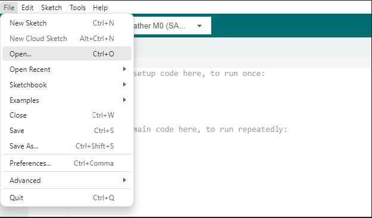
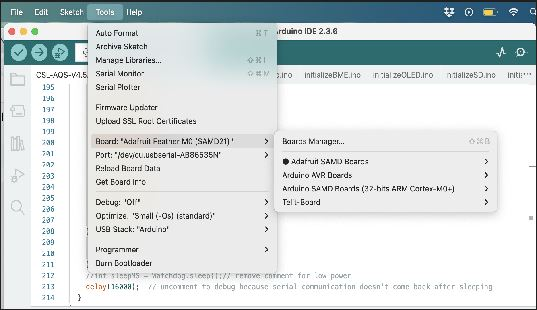
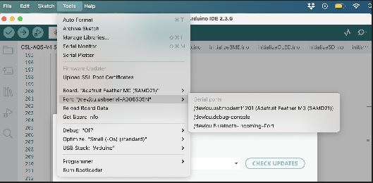
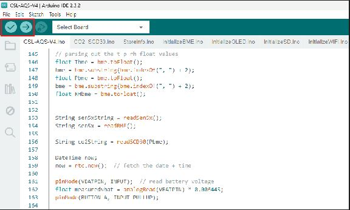

# Community Sensor Lab Air Quality Sensor Setup Guide

## Overview
The Community Sensor Lab's DIY Air Monitoring files include instructions on assembling and operating the air quality monitor. This guide will walk you through downloading the code, setting up your development environment, and configuring your sensor.

## Prerequisites
- Computer with internet access
- Air Quality Sensor hardware (Adafruit Feather M0)
- USB cable for connecting the sensor
- WiFi network credentials

---

## Step 1: Understanding GitHub and Accessing Our Code

[GitHub](https://github.com/) is an online platform where code is stored, shared, and collaboratively worked on. You **don't** need a GitHub account to visit the site or download the code.

### Accessing the Community Sensor Lab Repository

1. Visit: [Community Sensor Lab](https://github.com/Community-Sensor-Lab)
2. Go to the **Repositories** drop-down menu
3. Find and click on **Air-Quality-Sensor**

---

## Step 2: Exploring the Air Quality Sensor Repository

Once the [Air Quality Sensor Repository](https://github.com/Community-Sensor-Lab/Air-Quality-Sensor) opens, you'll see several important folders:

- **[CSL-AQS-V2.1](https://github.com/Community-Sensor-Lab/Air-Quality-Sensor/tree/master/CSL-AQS-V4)**: Contains all the code you need to run your Air Quality Sensor
- **[Images](https://github.com/Community-Sensor-Lab/Air-Quality-Sensor/tree/master/images)**: Contains all the images referenced in the [README.md file](https://github.com/Community-Sensor-Lab/Air-Quality-Sensor/blob/master/README.md), including instructions and additional information about AQS
- **[wifi_logger_proto.gs](https://github.com/Community-Sensor-Lab/Air-Quality-Sensor/blob/master/wifi_logger_proto.gs)**: Contains code for connecting the sensor to Google Sheets

---

## Step 3: Downloading the Code

1. Look for the green **Code** button  on the repository page
2. Click on it to reveal the dropdown menu
3. Under **HTTPS**, select **Download ZIP**

4. Click **Download ZIP** to start the download
5. Once the download is complete, locate the **Air-Quality-Sensor-master.zip** file
6. Extract the zip file:
   - **Windows**: Right-click the zip file and select "Extract All"
   - **macOS**: Double-click the zip file
   - **Linux**: Use your file manager or command line to extract
7. Save the extracted **Air-Quality-Sensor-master** folder in a location where you can easily find it again
8. **Important**: You will only need the **CSL-AQS-V2.1** folder for the main code
9. You can delete the zip file after extraction, but keep the images, README.md, and wifi_logger_proto.gs files for reference

---

## Step 4: Installing Arduino IDE

Before you can upload code to your sensor, you need to install the Arduino development environment.

### Installation Steps:

1. Visit the Arduino website: [https://www.arduino.cc/en/software](https://www.arduino.cc/en/software)
2. Scroll down and select the download version compatible with your operating system:
   - **Windows**: Windows Win 10 and newer
   - **macOS**: macOS Monterey or newer
   - **Linux**: Linux 64-bit
3. Follow the installation prompts based on your system
4. Once installed, open the Arduino IDE to confirm it's working correctly

### Installing Required Board Support:
1. Open Arduino IDE
2. Go to **Tools** > **Board** > **Boards Manager**
3. Search for "Adafruit SAMD" and install the **Adafruit SAMD Boards** package

---

## Step 5: Loading and Configuring the Code

### Opening the Code in Arduino IDE

1. In Arduino IDE, select **File** → **Open**
2. Navigate to your downloaded **CSL-AQS-V2.1** folder
3. Select the main `.ino` file to open the project

### Configuring Board Settings

Before **compiling** and **uploading** the code, you must configure the correct board and port settings.

#### Setting the Board:

1. Select **Tools** > **Board** > **Adafruit SAMD Boards** > **Adafruit Feather M0**
2. Verify the board name reads "Adafruit Feather M0 (SAMD21)"

#### Setting the Port:

1. Connect your Adafruit Feather M0 to your computer via USB
2. Select **Tools** > **Port** > **[Sensor Name]** (e.g., Adafruit Feather M0)
3. The port should match the Adafruit Feather M0 name (SAMD21)

### Compiling and Uploading the Code

After reviewing the code, use the two buttons on the left side of the **Tool Bar**:

1. **Checkmark (✔)**: Click to **compile** the sketch and check for errors
2. **Right Arrow (➔)**: Click to **upload** the code to your sensor

**Note**: Always compile first to check for errors before uploading.

---

## Step 6: WiFi and Google Sheets Configuration

This step connects your sensor to your WiFi network and enables data logging to Google Sheets.

### WiFi Provisioning Process

The sensor needs to be provisioned (set up) to connect to your WiFi network. **Important**: The sensor must connect to a standard WiFi network (not enterprise networks with special authentication).

#### Provisioning Steps:

1. **Power on your sensor** - The OLED screen will display the sensor's temporary WiFi network name
2. **Connect your phone or computer** to the AQS system's WiFi network (shown on the OLED screen)
3. **Open a web browser** and navigate to: [https://192.168.1.1/](https://192.168.1.1/)
4. **Enter your WiFi credentials**:
   - WiFi network name (SSID)
   - WiFi password
5. **Click 'Submit'** to save the configuration
6. **Wait for confirmation** - The sensor will restart and connect to your WiFi network

### Google Sheets Integration (Optional)

If you want to log data to Google Sheets, refer to the `wifi_logger_proto.gs` file in the repository for detailed setup instructions.

---

## Troubleshooting

### Common Issues:

- **Board not detected**: Ensure USB cable is properly connected and drivers are installed
- **Compilation errors**: Check that you have the correct board package installed
- **WiFi connection fails**: Verify network credentials and ensure you're using a standard WiFi network
- **Upload fails**: Press the "RESET" button on the board two times to get the Feather M0 board ready to receive code

### Getting Help:

Visit the [Community Sensor Lab GitHub repository](https://github.com/Community-Sensor-Lab/Air-Quality-Sensor) for additional resources and community support.

---

## Next Steps

Once your sensor is configured and connected:
1. Monitor air quality readings on the OLED display
2. Access logged data through your configured Google Sheets (if set up)
3. Consider joining the Community Sensor Lab community for tips and collaboration

**Happy monitoring!**