# Air Quality Monitor - Google Logging Spreadsheet Setup Guide

## Overview

With a connection to a WiFi network, you can upload the data from the Air Quality Monitor to a Google spreadsheet in real time. To accomplish this, you must sign in using a Google account.

We have created a spreadsheet template where the data will be automatically uploaded. The Air Quality Monitor can be programmed to send data via WiFi, Bluetooth, or serial communication to a Google Spreadsheet using a deployment protocol, as outlined in document number 6.

---

## Part I: Getting Started with the Spreadsheet

### Step I: Access the Spreadsheet Template
Click on the link to access the spreadsheet:
**[📊 CSL-AQS-Template](https://docs.google.com/spreadsheets/d/1c2Fz-3yoDlgtHRTSywHb1Qw0Rqlr5v1rYq2KaVxd2Ac/edit?gid=1424335735#gid=1424335735)**

### Step II: Make a Copy
Once the spreadsheet opens, go to the **File → menu** and **Make a Copy** of the spreadsheet. It's important you make a copy because this is not a spreadsheet you can edit.

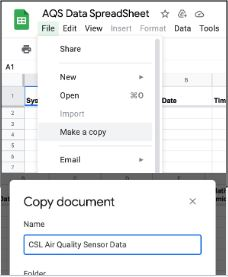

### Step III: Save and Name Your Copy
Save the copy in your own Google Drive to be able to edit it.

**Name the spreadsheet** to identify the location, project, owner, or any other label that will help identify the data for the specific air monitor. If you can find the GPS coordinates, you can add this to the spreadsheet's name.

### Step IV: Review the Data Structure
Notice the different titles with respective units of the spreadsheet columns. Once you have completed these steps, your spreadsheet will collect data in real time!

---

## Part II: Deploying Google Script for Remote Data Upload

### Understanding the Technology

**Tool:** [Google Apps Script](https://developers.google.com/apps-script) - a cloud-based scripting language integrated into Google Sheets

**Purpose:** The script will automate the process of updating the Google Sheet

**How It Works:** The script uses HTTP methods (GET, POST, PUT, DELETE) to send or retrieve data to and from Google Sheets

We will use App Script to update the Google Sheet via HTTP. Google Apps Script makes creating and publishing add-ons for Google Docs, Sheets, Slides, and Forms easy. To learn more, visit **[Automate & extend Google Workspace with Simple Code](https://developers.google.com/apps-script)**.

### Step I: Open the Script Editor
To open the Script Editor, go to the **Extensions** drop-down menu and select **Apps Script**.

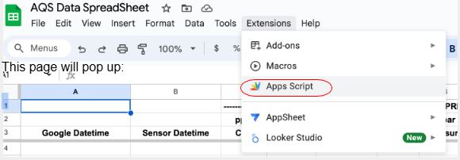

This page will pop up:

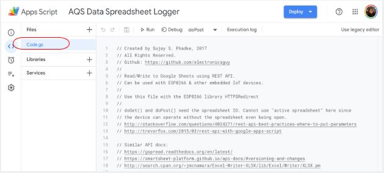

The AQS (Air Quality Systems) Data Spreadsheet Logger will pop up. If you get an error message instead, see the [Troubleshooting section](#troubleshooting) below.

The AQS collects, records, and stores air quality data.

### Step II: Verify or Add Script Code
If you have followed these steps **with** the spreadsheet template we provided, you should see several lines of code when you open the script editor. The code will be needed for the following steps.

**If you did not use the template:**
1. You can find the code in our Air Quality Sensor repository: **[github.com/Community-Sensor-Lab/Air-Quality-Sensor](https://github.com/Community-Sensor-Lab/Air-Quality-Sensor)**
2. Locate the file: `WiFi_logger_proto.gs`
3. Copy the code in this file and paste it into the script editor

### Step III: Configure Your Spreadsheet ID

#### Modifying Spreadsheet Name and ID
2. **Line 55** is an important line that you need to edit (line number is different in image below)

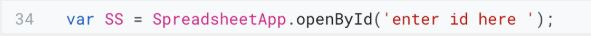

3. Line 55 says, `'enter id here.'` This line must be replaced with the **ID of your spreadsheet**. Every single Google Spreadsheet link has its unique ID

4. **To find the ID:** Return to your Google spreadsheet. The URL contains your spreadsheet ID

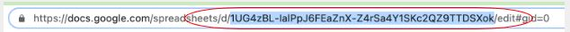

5. **Locate the ID:** The ID is located between the **d/** and the **/edit** of the URL. Copy this long string of characters and paste it between the quotation marks in the code, replacing the placeholder text: `"enter id here,"` as illustrated below:

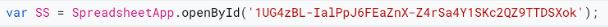

6. **Test the Script:** Press **"RUN"**

---

## Part III: Deploying Your App Script

### Step IV: Deploy the Application

Now that your App Script is ready, you must deploy it. An App Script deployment is a version of the script made available for use as a web app, add-on, or API executable.

1. **Deploy:** Go to the **Deploy** drop-down menu, and select **→ Manage Deployment**

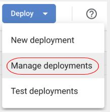

2. **Configuration:** The Configuration window will pop up

3. **Select Type:** Under the Menu Select **Type**, Select **Web app**

4. **New description:** Provide a brief and clear explanation of the script's purpose  
   Example: "automates data entry and processing for Google Sheets"

5. **Web app:** Write the email you used to complete this process in the Web App section

6. **Who has access:** Using the drop-down menu, choose **Anyone**. Selecting "Anyone" allows any user who visits the web app link to execute it, making it easier to share without requiring a Google credential

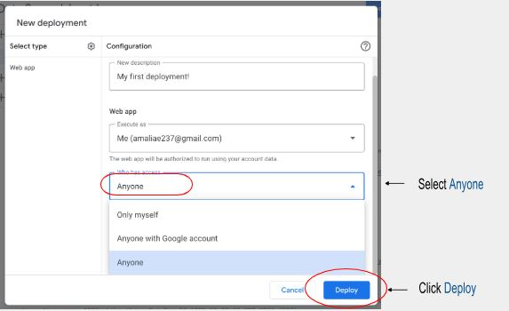

### Step V: Authorization Process

1. **New Deployment:** Click on the **"Authorize Access"** button

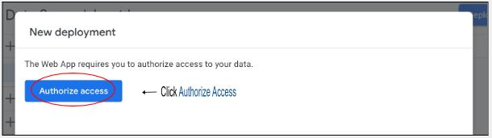

2. **Authorization:** Once you click Authorize access, the AQS Data Spreadsheet Logger screen will pop up requesting access to your Google Account

3. **Security Warning:** Another screen will pop up - click on **Go to AQS Data Spreadsheet Logger (unsafe)**

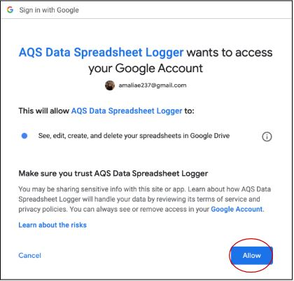
⟵ Click the **Allow** button

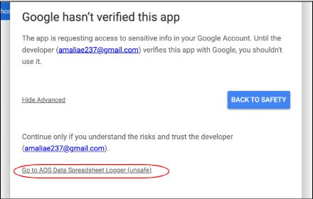

↑ Click Go to AQS Data Spreadsheet Logger (unsafe)

4. **Advanced Options:** Ignore this message - Google hasn't verified this app. Go to the bottom of the page and click on **Advanced**

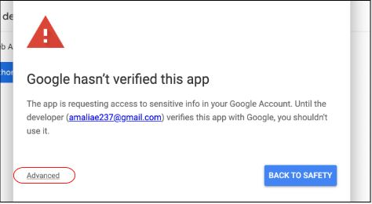

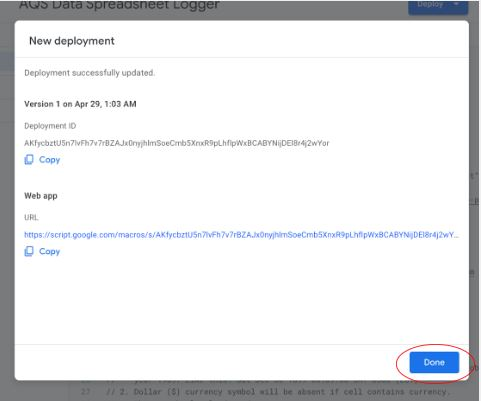

---

## Troubleshooting

### Script Editor Access Issues

**Problem:** If you get an error message window when trying to access the Script Editor

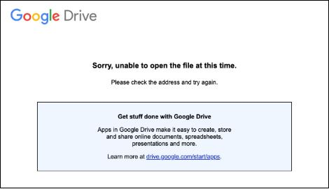

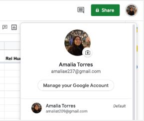
⟵ **Default email**

**Cause:** You are most likely not using your default Google account for your spreadsheet

Notice that the *Default email* is different than the one that appears on the error message.

**Solution:**
- You must sign out of your default Google account to correct this issue
- This may require signing out of all your accounts, as Google doesn't allow signing out of only one account when multiple accounts are signed in simultaneously
- Once you have signed out, you can sign in to your default account

**Steps to resolve:**
1. Sign in to the account you are using to access your Google Sheets
2. Once you sign into that account, return to the spreadsheet
3. Try opening the script editor again

### Common Issues and Solutions

- **Permission Errors:** Ensure you're consistently using the same Google account throughout the process
- **Spreadsheet ID Errors:** Double-check that you copied the complete ID string from the URL
- **Authorization Problems:** Follow the security warning steps carefully, even if they appear "unsafe"

---

## Additional Resources

- **[Google Apps Script Documentation](https://developers.google.com/apps-script)**
- **[Community Sensor Lab GitHub Repository](https://github.com/Community-Sensor-Lab/Air-Quality-Sensor)**
- **[Google Sheets API Reference](https://developers.google.com/sheets/api)**

---

## Next Steps

Once your deployment is complete, your Air Quality Monitor will be configured to automatically send data to your Google Spreadsheet. The system will collect, record, and store air quality data in real time, making it accessible for analysis and sharing with your community.