**Creating Charts with the Spreadsheet**

**Step I.** Use this Template[Walkshop-data](https://docs.google.com/spreadsheets/d/1RFhmyqTI_-M0KqMQCdK-JjGWuWDufaKyo__DD6yt2HA/edit?usp=sharing)

**Step II.** To select all data, follow the instructions below:

* Place the **cursor on Row 3, Column A**.   
  * To **Select** all Data on Google Sheets on a Mac: **Press Ctrl \+ Shift,**   
  * Now press the **↓Down Arrow** while still **pressing the Ctrl \+ Shift** (this will highlight selecting all the data in column A.    
  * To select the data across all Rows and Columns, **press the → Right Arrow**. Now, all of the data across the spreadsheet should be highlighted.

  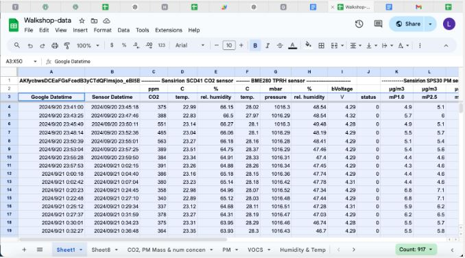

  * For Mac, with the cursor on  

**Step III.** To create the graph, Go to **Insert** and select **Chart** from the drop-down menu.

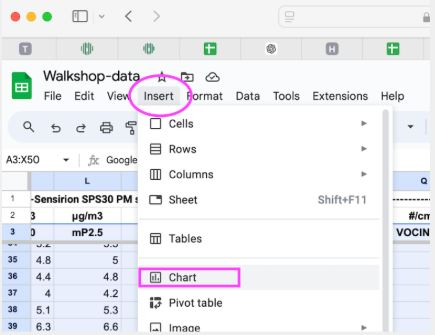
* A chart should pop up on top of your datasheet. 

**Step IV:** Click on the **three dots** at the top right corner of the chart and Select “**Move to own Sheet**.” This allows you to move a chart from its current location, embedded within a sheet, to a separate, dedicated new sheet.

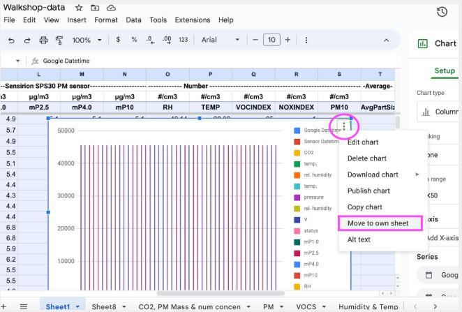

**Chart Editor:** The Chart Editor allows users to create, customize, and modify charts or graphs based on the data within the spreadsheet.

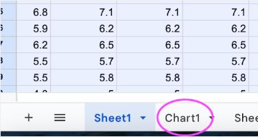 
**Step VI.** A new sheet tab is created at the bottom of your Google Sheets file.
Click on the **down arrow** and select **rename**   
to give the sheet a new name. 

**Step VII.** Click **Edit Chart** to open the Chart editor, which will appear on the right side of the screen.

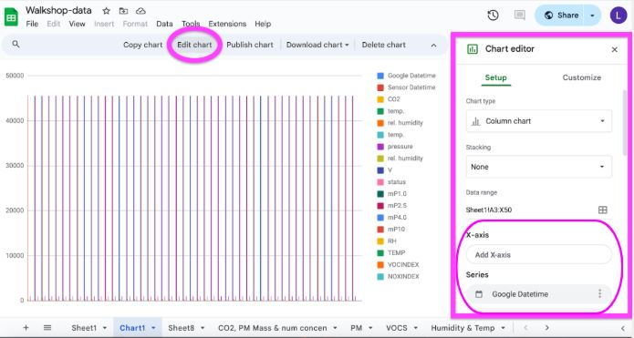

**Step VIII: Label X-Axis using the Chart Editor**

* Click “**Add X-axis**” in the Chart editor and select **Google Datatime**.

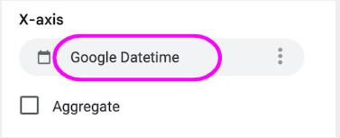

**Google Datetime** allows you to format and represent date and time data on charts, making it easier to visualize trends over specific periods.

**Step VIII: Remove Series**

* In this section of the **Chart Editor**, you will remove 

Next remove Google Datetime,   
Series Datetime, V, status and any other   
series you may not want to put in this   
particular graph.

Change the chart type under set up into a line chart and it should look like this

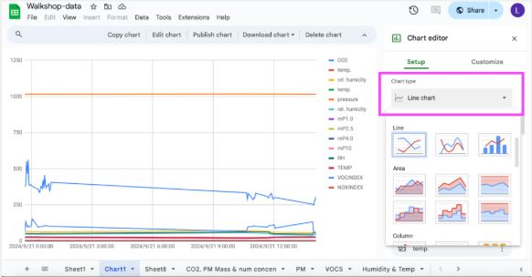

**Creating a Timeline Chart**

To make a timeline chart click timeline chart under chart type

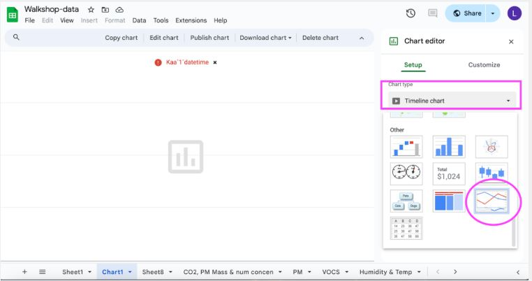

Be sure to have the following boxes selected:

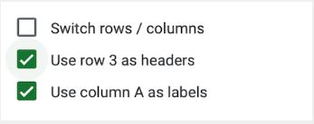
		

Press the cell boxes under Data range and select the data ranges from your data sheet (Sheet1) that you would like to include in the timeline chart.

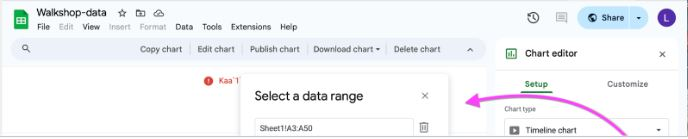

Your graph should now look like this (depending on the range cells you selected):  
\[In my case I selected all of A and C to H for: CO2, temp, humidity and pressure.\]

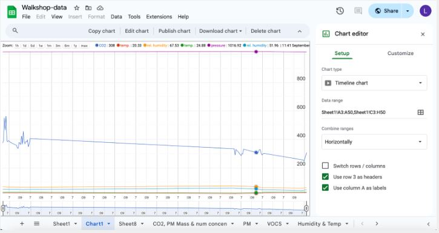

**Customize Data Lines**

Under the chart editor you can also customize the chart by changing the fill opacity or the line thickness using the drop down menu.

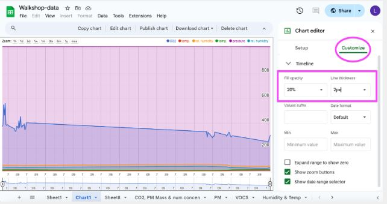