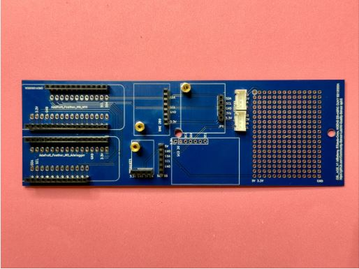
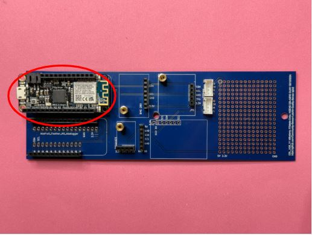
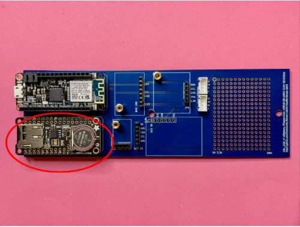
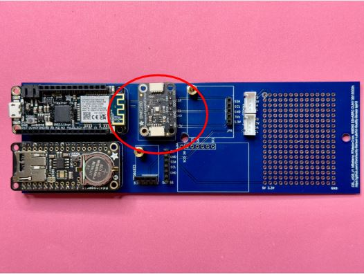
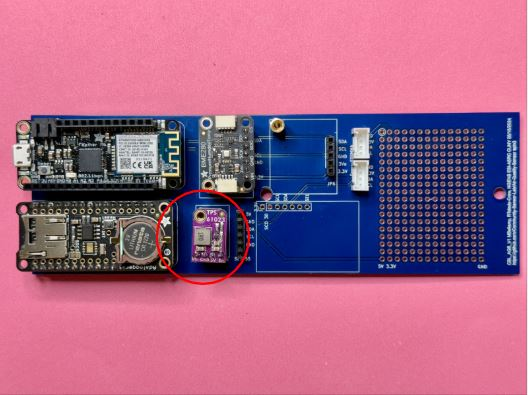
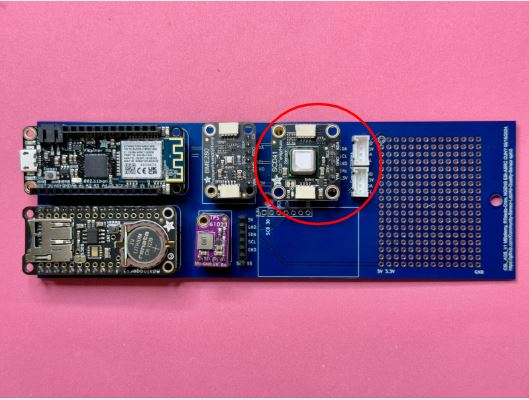
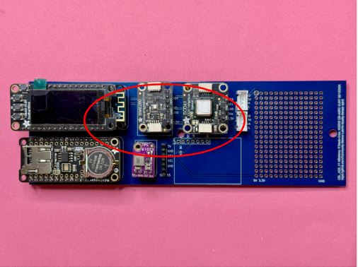
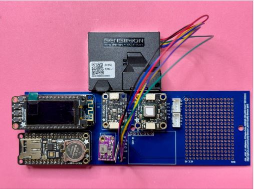

# Assembly of Air Quality Monitor Components on a PCB Board

## Materials:

- PCB board
- [Feather M0 WiFi (WINC1500)](https://www.adafruit.com/product/3010) Microcontroller and WiFi Radio
- [Featherwing Logger (RTC microSD)](https://www.adafruit.com/product/2922) Real-time Clock and MicroSD Reader
- [Featherwing OLED 128x64](https://www.adafruit.com/product/2900) Display Screen
- [Adafruit SCD41 CO2 Sensor](https://www.adafruit.com/product/5190)
- [BME280 Temp. Press. Rel Humidity Sensor](https://www.adafruit.com/product/2652)
- [Sensirion SEK-SEN5X](https://www.sensirion.com/products/catalog/SEK-SEN5X/) Particulate Matter/VOC/NOX Sensor
- [MiniBoost 5V](https://www.adafruit.com/product/4654)
- Standoff Screws with Hex Nuts and Cap Screw Bolt
- Battery Pack

## Tools:

- [H 1.5 Screwdriver](https://www.adafruit.com/product/3790)

## Assembly STEPS

1. Place the PCB in the same orientation as the Photo.

---

## Step I. Connect the Feather M0 WiFi (WINC1500)

1. **Locate the Feather M0 WiFi:**
   - Notice that the PCB board's label, "Feather M0 WiFi," is printed on the upper left-hand side.

2. **Align the Feather M0 WiFi:**
   - Before making any connections, carefully align the header pins directly above the female sockets on the PCB. Double-check to ensure that all pins are correctly positioned over the corresponding sockets.

3. **Position and Check Alignment:**
   - Ensure that the pins are directly about the socket and are evenly aligned before pressing them into place. Any misalignment could cause the pins to bend or damage them.

4. **Gently Insert the Pins:**
   - With the pins aligned, gently press the Feather M0 WiFi into the sockets. Apply light pressure, and if necessary, gently wiggle the board slightly to help the pins slide smoothly into the sockets.

**Note:** The Feather M0 WiFi (WINC1500) is equivalent to a computer's central processing unit (CPU).

---

## Step II. Connect the Featherwing Logger (RTC MicroSD)

1. **Locate the Feather M0 Adalogger:**
   - Notice that the PCB board's label, "Feather M0 Adalogger," is printed on the bottom left-hand side.
   - Follow the same installation techniques and instructions above.

**Note:** The Featherwing M0 AdaLogger is equivalent to a computer's memory and data storage.

---

## Step III. Connect the BME280 Temp. Pressure Relative Humidity Sensor

1. **Locate the [BME280](https://www.bosch-sensortec.com/products/environmental-sensors/humidity-sensors-bme280/) Temp. Pressure, and Humidity Sensor:**
   - This sensor has seven pins. Locate the label 'BME280' printed on the board.
   - Connect the BME280 sensor by inserting the pins in the 7-pin socket.

---

## Step IV. Connect the MiniBoost 5V - 3.3 to 5V (Voltage) Converter

1. **Locate the MiniBoost 5V - 3.3 to 5V Voltage Converter:**
   - Connect the MiniBoost 5V directly below the BME280 sensor.
   - Insert the four pins in the sockets labeled: 3V, GND, 5V, and EN.

---

## Step V. Connect the Adafruit SCD41 CO2 Sensor

1. **Locate the SCD41 CO2 Sensor:**
   - Locate the label 'SCD' printed on the board.
   - Connect the SCD41 CO2 Sensor to the right of the BME280 sensor.
   - Insert the five pins into the sockets labeled SDA, SCL, GND, 3V0, and 3.3V.

---

## Step VI. Connect the Featherwing OLED 128x64 Display Screen

1. **Locate the OLED Display Screen:**
   - Locate the OLED Display Screen.
   - Connect the OLED Display to the Feather M0 WiFi.
   - Align the pins and press gently until they are completely inserted and no longer visible.

**Note:** The OLED Display is equivalent to a computer screen.

---

## Step VII. Connect the Sensirion SEK-SEN5X Particulate Matter/VOC/NOX Sensor

1. **Locate the Sensirion SEK-SEN5X Particulate Matter/VOC/NOX Sensor:**
   - The sensor has six color-coded wires connected to pins.
   - On the board to the right of the MiniBoost 5V 3.3 to 5V Voltage Converter, locate the six sockets labeled 5V, GND, SDA, SCL, and GND.
   - Align the pins starting with the labeled red 5V wire, and align it with the 5V socket.
   - Carefully locate the corresponding sockets for each color-coded wire from the sensor.
   - The last wire, colored purple, should be connected to the previous socket labeled GND.
   - Connect the wires to the corresponding sockets, making sure the pins are no longer visible.
   - Align the pins and press gently until they are completely inserted and no longer visible.

---

## Final Assembly Notes

### Power Connection
- Connect your battery pack to provide power to the entire system
- The MiniBoost 5V converter will regulate power distribution to components requiring different voltages

### Testing
- Once all components are installed, power on the system
- The OLED display should show initialization messages
- Verify all sensors are detected and providing readings

### Troubleshooting
- If components are not detected, check all connections are secure
- Ensure pins are fully inserted into their sockets
- Verify correct alignment of all components

## Next Steps

After successful assembly, you'll need to:
1. Install the appropriate firmware
2. Configure WiFi settings for data transmission
3. Set up data logging and monitoring
4. Calibrate sensors if required

Your air quality monitor is now ready to help track environmental conditions and contribute to community air quality awareness!