## **Featherwing Components**
|||||
| ---- | ---- | ---- | ---- |
| NEW! Feather ESP32 V2 |  | Microcontroller and Wifi It is the CPU of the system. | [Adafruit Store](https://www.adafruit.com/product/5400) |
| Adalogger FeatherWing MicroSD and Clock |  | Real-time Clock and MicroSD Reader. It is the hard drive and data storage of the device. | [Adafruit Store](https://www.adafruit.com/product/2922) |
| Featherwing OLED 128x64 |  | Display. It is the computer screen. | [Adafruit Store](https://www.adafruit.com/product/4650) |

## **Sensors**
|||||
| ---- | ---- | ---- | ---- |
| Adafruit SCD41 CO2 |  | CO2 NDIR Sensor | [Adafruit Store](https://www.adafruit.com/product/5190) |
| BME280 TPRH | 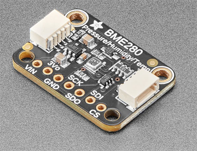 | Temperature, Pressure, Relative Humidity Sensor | [Adafruit](https://www.adafruit.com/product/2652) |
| Sensirion SEN5X | 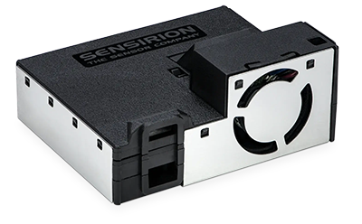 | Particulate Matter PM, VOCs, NOX Sensor | [DigiKey](https://www.digikey.com/en/products/detail/sensirion-ag/SEK-SEN5X/15903862) |

## **Additional Parts**

|||||
| ---- | ---- | ---- | ---- |
| MiniBoost 5V |  | 3.3 to 5 Voltage Converter | [Adafruit](https://www.adafruit.com/product/4654) |
| Coin Battery CR1220 |  | Battery for RTC| [Adafruit](https://www.adafruit.com/product/380) |
| Micro SD 4GB min | 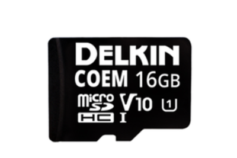 | Permanent Data Storage on the Device | [DigiKey](https://www.digikey.com/en/products/detail/delkin-devices-inc/USDCOEM-16GB/13882332) |
| 4 Pin Headers | 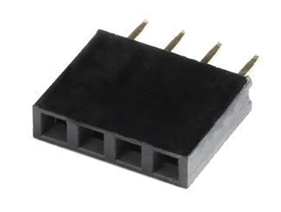 | For MiniBoost 3.3 to 5 Volt. Converter | [DigiKey](https://www.digikey.com/en/products/detail/sullins-connector-solutions/PPTC041LFBN-RC/810144) |
| 5 Pin Headers | 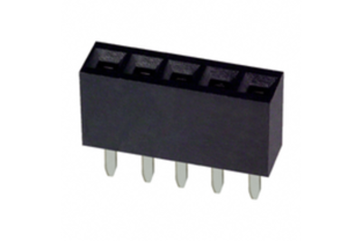 | For the SCD41 CO2 sensor | [DigiKey](https://www.digikey.com/en/products/detail/sullins-connector-solutions/PPTC051LFBN-RC/807239) |
| 6 Pin Headers | 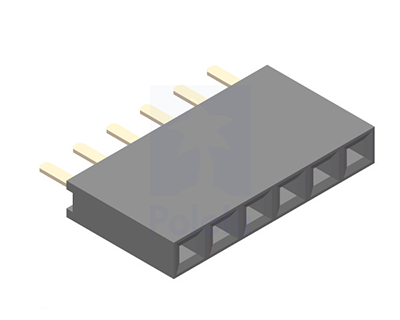 | For the Particulate Matter Sensor | [DigiKey](https://www.digikey.com/en/products/detail/würth-elektronik/61300611821/16608482) |
| 7 Pin Headers |  | 7 Pin Header for BME280 and SCD30 | [DigiKey](https://www.digikey.com/en/products/detail/sullins-connector-solutions/PPTC071LFBN-RC/810146) |
| 12 Pin Headers | 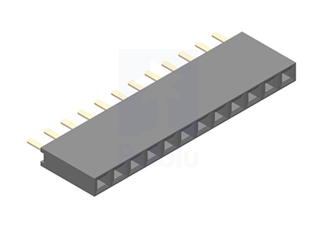 | For the Feather boards | [DigiKey](https://www.digikey.com/en/products/detail/sullins-connector-solutions/PPTC121LFBN-RC/807231) |
| 16 Pin Headers |  | For Feather boards | [DigiKey](https://www.digikey.com/en/products/detail/sullins-connector-solutions/PPTC161LFBN-RC/810154) |
| Feather Stacking Headers Set |  | Stacking headers for Feather ESP32 V2 | [Adafruit](https://www.adafruit.com/product/2830) |
| Grove Female Header DIP-4P-2.0mm (optional) |  | i2c Grove Connector | [Seeed Studio](https://www.seeedstudio.com/Grove-Universal-4-pin-connector.html) |
| Custom PCB CSL (Gerber files [here]( ../E_CAD  )) |  | PCB Board | [PCBWay](https://www.pcbway.com/) |
| PVC Tube Charlotte type is best |  | 3" ID, 7" Length Tube | [Home Depot](https://www.homedepot.com/p/Charlotte-Pipe-3-in-x-2-ft-PVC-DWV-Sch-40-Pipe-PVC073000200HA/100533056) |
| PVC Cap | 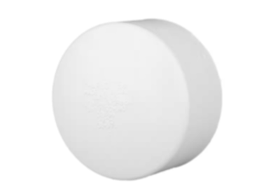 | PVC Cap 3 Inch Diameter | [Home Depot](https://www.homedepot.com/p/3-in-PVC-DWV-Cap-PVC001161000HD/203393254) |
| Type C Cable | 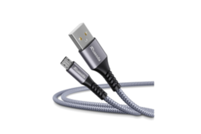 | Micro USB Cable | [Amazon](https://www.amazon.com/Ruaeoda-Micro-Android-Charger-Gold-Plated/dp/B0D7RZJSPS/ref=sr_1_10?s=industrial&sr=1-10) |
| Grainger #6 Screw |  | 6-32 x 1/2'' Socket Head Screw | [McMaster-Carr](https://www.mcmaster.com/catalog/130/3555/92196A146) |
| 6#-32 Lock Nuts | 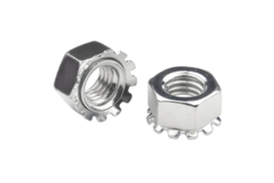 | 6#-32 Lock Nuts | [Amazon](https://www.amazon.com/dp/B09V2SMKCS?ref=cm_sw_r_cp_ud_dp_85DV0K4XSP3YVNZTQ9CF&ref_=cm_sw_r_cp_ud_dp_85DV0K4XSP3YVNZTQ9CF&social_share=cm_sw_r_cp_ud_dp_85DV0K4XSP3YVNZTQ9CF&skipTwisterOG=2&th=1) |
| 11mm, M2.5 Standoffs | 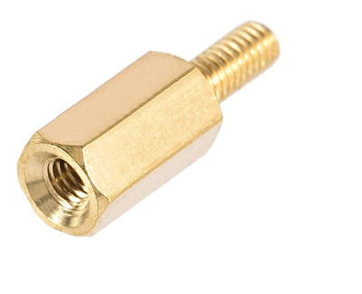 | 100 Pcs M2.5 11mm Standoffs | [Amazon](https://www.amazon.com/dp/B0BK99T8S4?_encoding=UTF8&psc=1&ref=cm_sw_r_cp_ud_dp_NJHTWAXYMZAMQTEPGTWG&ref_=cm_sw_r_cp_ud_dp_NJHTWAXYMZAMQTEPGTWG&social_share=cm_sw_r_cp_ud_dp_NJHTWAXYMZAMQTEPGTWG&skipTwisterOG=2) |
| Hex Nuts, M2.5x0.45mm |  | 100 Pcs M2.5x0.45mm Hex Nuts | [Amazon](https://www.amazon.com/dp/B07H3WGLJN?_encoding=UTF8&psc=1&ref=cm_sw_r_cp_ud_dp_YWEFJ3H8FVGTAFAJ55B1&ref_=cm_sw_r_cp_ud_dp_YWEFJ3H8FVGTAFAJ55B1&social_share=cm_sw_r_cp_ud_dp_YWEFJ3H8FVGTAFAJ55B1&skipTwisterOG=2) |
| M2.5x6mm Screws | 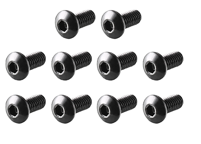 | 100 Pcs M2.5x6mm Screws | [Amazon](https://www.amazon.com/dp/B01B1PGR22?_encoding=UTF8&psc=1&ref=cm_sw_r_cp_ud_dp_V3CT5FRAVAEGDJX2H49D&ref_=cm_sw_r_cp_ud_dp_V3CT5FRAVAEGDJX2H49D&social_share=cm_sw_r_cp_ud_dp_V3CT5FRAVAEGDJX2H49D&skipTwisterOG=2) | |