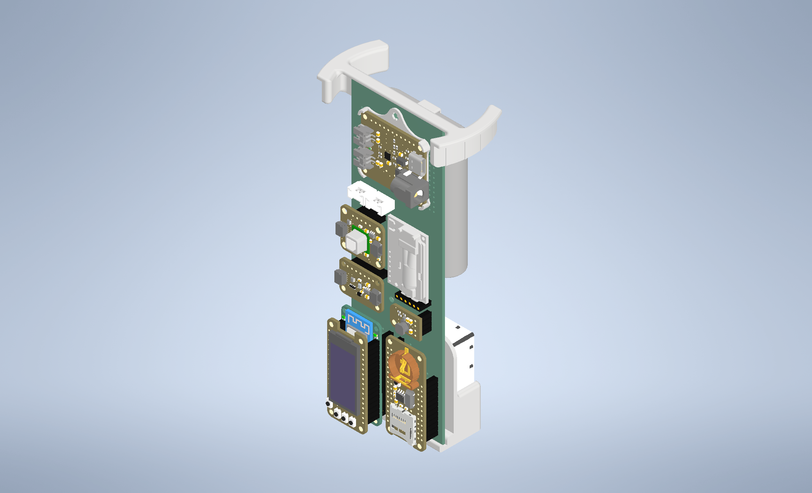
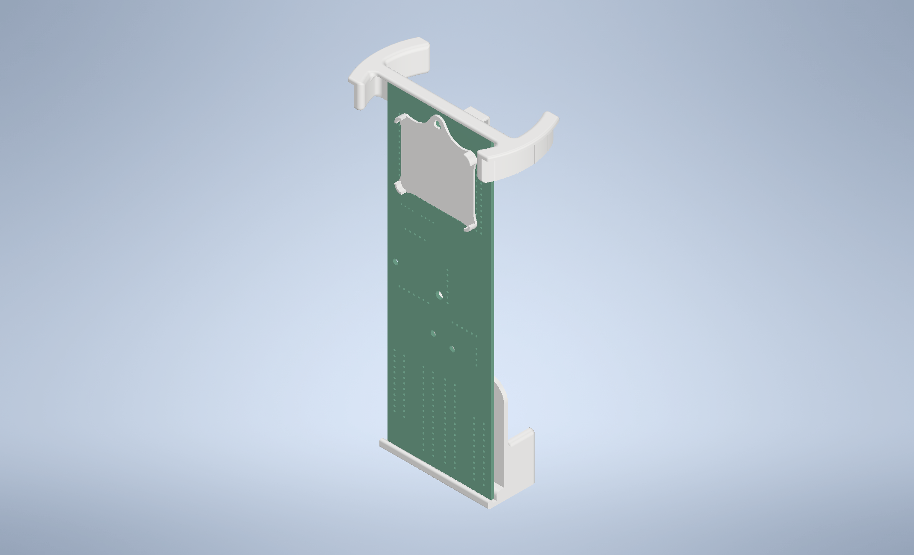

# Air Quality Sensor CAD

### Most up-to-date CAD files for the Air Quality Sensor, including all mounts, stands and soldering tools.
---

Complete Assembly of AQS with all Sensors

Complete Assembly of Mounts Only

---

>**All Mounts are Modeled using Inventor 2025**  
[Step Files included for Mounts Only]