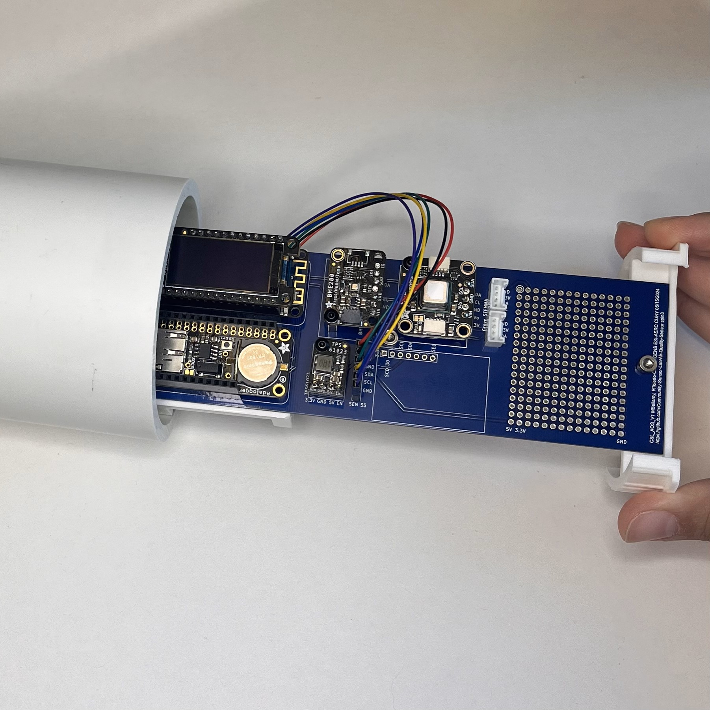

#  Air Quality Sensor Assembly Guide
##  Detailed Step-by-Step Version

*Complete educational walkthrough for building your environmental monitoring station*

---

##  About This Guide

This comprehensive guide provides **detailed, step-by-step instructions** for building an air quality monitoring system using Arduino-compatible components. Perfect for **classroom environments** and **self-paced learning**.

###  What You'll Build

  
  

> **A complete air quality monitoring system** that measures temperature, humidity, CO2, VOC/NOX, and particulate matter—with data logging, real-time display, and cloud connectivity.

###  Project Specifications

| **Sensors** | **Data Storage** | **Connectivity** | **Display** |
|:-----------:|:----------------:|:----------------:|:-----------:|
| 5 Environmental | SD Card Logging | WiFi + Google Sheets | OLED Real-time |
| CO₂, VOC, PM2.5 | RTC Timestamps | Hotspot Provisioning | Serial Monitor |
| Temperature/Humidity | Offline Capable | Network Diagnostics | Status LEDs |

###  Educational Outcomes
By completing this detailed guide, students will master:
- **Hardware Skills**: Soldering, breadboarding, component assembly
- **Software Skills**: Arduino programming, library management, debugging
- **IoT Integration**: WiFi setup, cloud services, data visualization
- **Data Science**: Time series analysis, environmental monitoring concepts
- **Engineering Process**: Testing, troubleshooting, documentation

---

##  Quick Navigation

| **For Quick Start** | **For Deep Learning** |
|:-------------------:|:---------------------:|
|  [Streamlined Guide](Readme.md) |  *This Detailed Guide* |
| Perfect for experienced builders | Complete educational walkthrough |

---

##  Comprehensive Guide Contents

###  **Phase 1: Preparation & Setup**

| Section | Title | Author | Skills Developed | Duration |
|:-------:|-------|--------|------------------|:--------:|
| **0** | [ **Parts Inventory**](Contents/Parts-List.md) | *Mark* | Component identification, organization | 30 min |
| **1** | [ **Skills & Safety**](Contents/1.%20Required-Skills-and-Tools.md) | *Lorena* | Soldering, safety, tool usage, multimeter testing | 1 hour |
| **2** | [ **Arduino IDE Setup**](Contents/2.%20Installing-Arduino-and-Getting-Started-2.3.6.md) | *Vincent* | Software installation, board connection, basic programming | 45 min |

###  **Phase 2: Hardware Assembly**

| Section | Title | Author | Skills Developed | Duration |
|:-------:|-------|--------|------------------|:--------:|
| **3** | [ **Soldering Workshop**](Contents/3.%20Soldering-Pins-and-Headers-on-Boards.md) | | Advanced soldering, header installation, cable modification | 2 hours |
| **3.5** | [ **WiFi Provisioning**](Contents/3.5%20Feather-M0-WiFi-Setup-Procedure.md) | | Network configuration, wireless setup | 30 min |
| **4** | [ **Breadboard Assembly**](Contents/4%20Breadboard-Assembly-and-Component-Code-Testing.md) | *Lorena* | Circuit building, sensor integration, testing procedures | 1.5 hours |

**Key Learning Points:**
- **Soldering Mastery**: Header pins, stacking headers, JST connector rewiring
- **Component Integration**: BME280 → SCD41 → SEN5x sensor chain
- **Power Management**: RTC battery installation, SD card formatting
- **Testing Protocols**: Serial monitor diagnostics, OLED status display

###  **Phase 3: Programming & Integration**

| Section | Title | Author | Skills Developed | Duration |
|:-------:|-------|--------|------------------|:--------:|
| **5** | [ **Code Integration**](Contents/5.%20Code-Activity.md) | *Lorena* | Code merging, programming logic, debugging | 45 min |
| **6** | [ **Firmware Deployment**](Contents/6.%20Downloading-CSL-AQS-Code-from-GitHub.md) | *Mark* | GitHub workflows, firmware flashing, troubleshooting | 30 min |

**Technical Focus:**
- **Code Architecture**: Understanding sensor libraries and data flow
- **Debugging Skills**: Serial output analysis, OLED diagnostics
- **Version Control**: GitHub integration, firmware management

###  **Phase 4: Data & Connectivity**

| Section | Title | Author | Skills Developed | Duration |
|:-------:|-------|--------|------------------|:--------:|
| **7** | [ **Cloud Integration**](Contents/7.%20Posting-to-Google-Logging-Spreadsheet.md) | *Vincent* | API integration, cloud services, data streaming | 45 min |
| **8** | [ **Data Visualization**](Contents/8.%20How-to-Make-Data-Graphs-Lines-and-Time-Series.md) | *Ricardo* | Time series analysis, graph creation, trend analysis | 1 hour |

**Data Science Skills:**
- **Cloud APIs**: Google Sheets integration, automated logging
- **Visualization**: Time series plots, environmental trend analysis
- **Analysis**: Pattern recognition in air quality data

###  **Phase 5: Professional Assembly**

| Section | Title | Author | Skills Developed | Duration |
|:-------:|-------|--------|------------------|:--------:|
| **9** | [ **PCB Design**](Contents/9.%20Design-and-Assembly-of-PCB.md) | *Mark* | PCB layout, professional assembly, manufacturing | 1 hour |
| **9.8** | [ **Assembly of AQS Monitor on PCB Board**](Contents/9.8%20Assembley-of-AQS-Monitor-on-PCB-Board.md) | | Soldering components, wiring sensors, PCB mounting | 50 min |
| **10** | [ **Enclosure Design**](Contents/10.%20AQS-PCB-Mount.md) | *Vincent* | 3D printing, mechanical design, product finishing | 45 min |

**Engineering Skills:**
- **PCB Development**: Design files, ordering process, assembly techniques
- **Mechanical Design**: 3D printed mounts, PVC enclosures
- **Product Integration**: Professional finish, deployment readiness

---

##  Learning Path Recommendations

###  **For Individual Learners**
1. **Start with Phase 1** → Build foundational skills
2. **Take breaks between phases** → Allow time for concept absorption
3. **Document your progress** → Keep a build journal
4. **Test thoroughly at each step** → Catch issues early

###  **For Classroom Use**
- **Session 1**: Parts inventory + Skills training (Sections 0-1)
- **Session 2**: Arduino setup + Soldering workshop (Sections 2-3)
- **Session 3**: Assembly + Testing (Section 4)
- **Session 4**: Programming + Cloud setup (Sections 5-7)
- **Session 5**: Data analysis + PCB assembly (Sections 8-10)

###  **For Experienced Builders**
- Use the [ Streamlined Guide](Readme.md) for faster assembly
- Reference this guide for detailed troubleshooting
- Focus on Phases 4-5 for advanced features

---

##  Important Prerequisites

###  **Knowledge Requirements**
-  Basic computer literacy
-  Willingness to learn electronics
-  Patience for step-by-step assembly
-  Basic understanding of environmental science (helpful)

###  **Required Equipment**
-  Soldering iron and supplies
-  Computer with USB port
-  Internet connection for downloads
-  Workspace with good lighting

---

##  Getting Help

###  **Support Resources**
- **Issues & Bugs**: Use GitHub Issues for technical problems
- **Discussion**: GitHub Discussions for general questions
- **Documentation**: Refer to individual section guides
- **Troubleshooting**: Each section includes diagnostic steps

###  **Success Indicators**
- [ ] All sensors reading valid data
- [ ] SD card logging timestamps
- [ ] OLED display showing current readings
- [ ] WiFi connected and uploading to Google Sheets
- [ ] Clean, professional assembly

---

##  Project Completion

Upon finishing this guide, you'll have:
- **A fully functional air quality monitoring station**
- **Real-time environmental data collection**
- **Cloud-connected data logging system**
- **Comprehensive electronics and programming skills**
- **Ability to analyze environmental trends**

---

**Ready to get started? Follow the detailed sections above for complete assembly instructions.**

